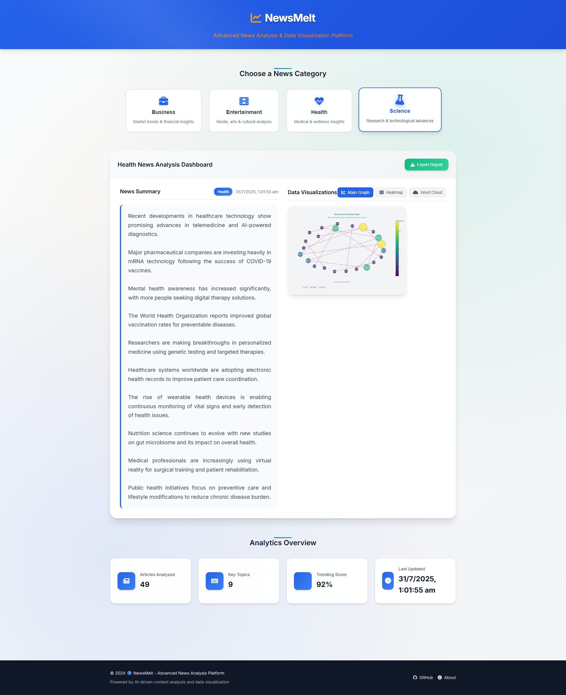

# 🔵 NewsMelt - Advanced News Analysis & Data Visualization Platform



A sophisticated news processing pipeline that combines AI-powered content extraction, advanced NLP techniques, and interactive data visualizations to provide comprehensive news analysis across multiple categories.

## 🚀 Features

### 📊 **Multi-Dimensional Data Visualization**
- Interactive charts and graphs using Plotly
- Heatmap visualizations for topic analysis
- Word cloud generation for keyword extraction
- Real-time analytics dashboard

### 🤖 **AI-Powered Content Analysis**
- **Pegasus-XSum**: Advanced abstractive summarization
- **T5-Base Fine-tuned**: News title classification
- **SpaCy**: Named Entity Recognition (NER)
- **NLTK**: Text preprocessing and analysis
- **NetworkX**: Graph-based content analysis

### 📰 **Comprehensive News Processing**
- Multi-source news aggregation (NewsAPI, RSS feeds)
- Full content extraction with fallback mechanisms
- Topic classification across 8 categories
- Multi-document summarization
- Sentiment analysis and trend detection

### 🎯 **Smart Content Categorization**
- **Business**: Market trends, financial insights
- **Entertainment**: Media, arts, cultural analysis  
- **Health**: Medical, wellness insights
- **Science**: Research, technological advances
- **Technology**: AI, innovation, digital trends
- **Politics**: Government, policy analysis
- **Sports**: Athletic events, team analysis
- **World**: International affairs, global news

## 🛠️ Technology Stack

### **Core Technologies**
- **Python 3.8+**: Main programming language
- **Transformers (Hugging Face)**: State-of-the-art NLP models
- **PyTorch**: Deep learning framework
- **Pandas & NumPy**: Data manipulation and analysis
- **Plotly**: Interactive visualizations
- **NetworkX**: Graph analysis and visualization

### **NLP Models Used**
1. **google/pegasus-xsum** (2.1GB)
   - Abstractive text summarization
   - Optimized for news content
   - Generates concise, informative summaries

2. **mrm8488/t5-base-finetuned-news-title-classification** (850MB)
   - Fine-tuned T5 model for news categorization
   - 8-category classification system
   - High accuracy on news title classification

3. **en_core_web_sm** (SpaCy)
   - Named Entity Recognition
   - Part-of-speech tagging
   - Dependency parsing

### **Web Technologies**
- **HTML5/CSS3**: Modern, responsive interface
- **JavaScript (ES6+)**: Interactive functionality
- **Font Awesome**: Icon library
- **Google Fonts**: Typography

## 📦 Installation & Setup

### **Prerequisites**
- Python 3.8 or higher
- Git
- 4GB+ RAM (for model loading)
- 5GB+ free disk space

### **1. Clone the Repository**
```bash
git clone https://github.com/yourusername/News-Extractor-Summarizer.git
cd News-Extractor-Summarizer
```

### **2. Create Virtual Environment**
```bash
# Windows
python -m venv venv
venv\Scripts\activate

# macOS/Linux
python3 -m venv venv
source venv/bin/activate
```

### **3. Install Dependencies**
```bash
pip install -r requirements.txt
```

### **4. Set Up Environment Variables**
Create a `.env` file in the root directory:
```env
# Required API Keys
NEWS_API=your_news_api_key_here
```

### **5. Download NLP Models**

#### **Option A: Automatic Download (Recommended)**
The models will be automatically downloaded on first run:
```bash
python main.py
```

#### **Option B: Manual Download**
```bash
# Create cache directory
mkdir -p cache_dir/transformers

# Download Pegasus-XSum model
python -c "from transformers import PegasusForConditionalGeneration, AutoTokenizer; PegasusForConditionalGeneration.from_pretrained('google/pegasus-xsum', cache_dir='cache_dir/transformers'); AutoTokenizer.from_pretrained('google/pegasus-xsum', cache_dir='cache_dir/transformers')"

# Download T5-Base Fine-tuned model
python -c "from transformers import T5ForConditionalGeneration, AutoTokenizer; T5ForConditionalGeneration.from_pretrained('mrm8488/t5-base-finetuned-news-title-classification', cache_dir='cache_dir/transformers'); AutoTokenizer.from_pretrained('mrm8488/t5-base-finetuned-news-title-classification', cache_dir='cache_dir/transformers')"

# Download SpaCy model
python -m spacy download en_core_web_sm
```

### **6. Run the Application**

#### **Backend Processing**
```bash
# Run the complete pipeline
python main.py

# Or run individual components
python run.py
```

#### **Frontend Interface**
Open `app/index.html` in your web browser or serve it using a local server:
```bash
# Using Python
python -m http.server 8000

# Using Node.js (if installed)
npx serve app
```

## 🔧 Configuration

### **Model Configuration**
Models are configured in `src/utils/config.py`:

```python
# Summarization Model
SUMMARIZATION_CONFIG = {
    'model_name': 'google/pegasus-xsum',
    'max_length': 150,
    'num_beams': 4,
    'temperature': 1.0
}

# Topic Classification Model
TOPIC_MODELING_CONFIG = {
    'model_path': 'cache_dir/transformers/mrm8488/t5-base-finetuned-news-title-classification',
    'batch_size': 10
}
```

### **API Configuration**
```python
# News API Settings
NEWS_API_CONFIG = {
    'query': 'business economy finance market...',
    'language': 'en',
    'sort_by': 'popularity',
    'page_size': 100
}
```

## 📁 Project Structure

```
News-Extractor-Summarizer/
├── app/                    # Frontend web interface
│   ├── index.html         # Main dashboard
│   ├── script.js          # Interactive functionality
│   └── style.css          # Styling
├── src/                   # Backend source code
│   ├── core/             # Core processing modules
│   │   ├── content_extractor.py
│   │   ├── graph_summarizer.py
│   │   ├── news_crawler.py
│   │   ├── summarizer.py
│   │   └── topic_classifier.py
│   ├── pipeline.py       # Main orchestration
│   └── utils/            # Utilities and config
├── cache_dir/            # Model cache (gitignored)
├── dataset/              # Processed data (gitignored)
├── output/               # Generated outputs (gitignored)
├── main.py              # Entry point
├── run.py               # Alternative runner
└── requirements.txt     # Dependencies
```

## 🎯 Usage Examples

### **Basic News Analysis**
```python
from src.pipeline import PipelineOrchestrator

# Initialize and run pipeline
orchestrator = PipelineOrchestrator()
success = orchestrator.run_pipeline()
```

### **Custom Topic Analysis**
```python
from src.core.topic_classifier import TopicClassifier

classifier = TopicClassifier()
topic = classifier.classify_text("Your news article text here")
print(f"Classified as: {topic}")
```

### **Multi-Document Summarization**
```python
from src.core.summarizer import MultiSummarizer

summarizer = MultiSummarizer()
summary = summarizer.summarize_text("Your long article text here")
print(f"Summary: {summary}")
```

## 🔍 API Keys Setup

### **NewsAPI**
1. Visit [NewsAPI.org](https://newsapi.org/)
2. Sign up for a free account
3. Get your API key from the dashboard
4. Add to `.env`: `NEWS_API=your_key_here`


## 🚨 Troubleshooting

### **Model Download Issues**
```bash
# Clear cache and retry
rm -rf cache_dir/transformers/*
python main.py
```

### **Memory Issues**
- Reduce batch sizes in config
- Use smaller models for testing
- Ensure sufficient RAM (4GB+ recommended)

### **API Rate Limits**
- Implement retry mechanisms
- Use multiple API keys
- Respect rate limits in configuration

## 🤝 Contributing

1. Fork the repository
2. Create a feature branch (`git checkout -b feature/amazing-feature`)
3. Commit your changes (`git commit -m 'Add amazing feature'`)
4. Push to the branch (`git push origin feature/amazing-feature`)
5. Open a Pull Request

## 📄 License

This project is licensed under the MIT License - see the [LICENSE](LICENSE) file for details.

## 🙏 Acknowledgments

- **Hugging Face** for the transformer models
- **NewsAPI** for news data
- **SpaCy** for NLP tools
- **Plotly** for visualizations

## 📞 Support

- **Issues**: [GitHub Issues](https://github.com/yourusername/News-Extractor-Summarizer/issues)
- **Discussions**: [GitHub Discussions](https://github.com/yourusername/News-Extractor-Summarizer/discussions)
- **Email**: your.email@example.com

---

**Made with ❤️ by Tuhin-SnapD**

*Transform your news consumption with AI-powered insights and beautiful visualizations.*
